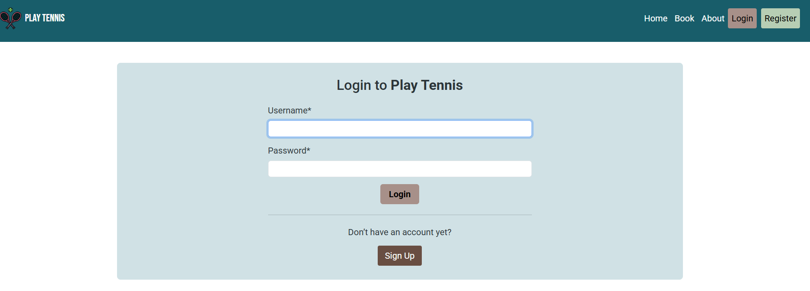
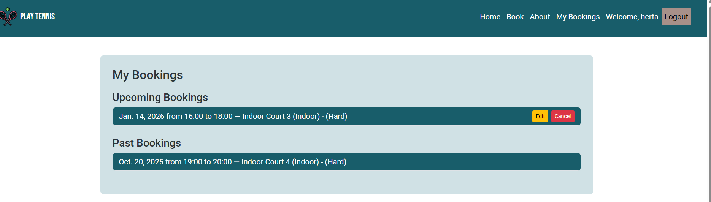
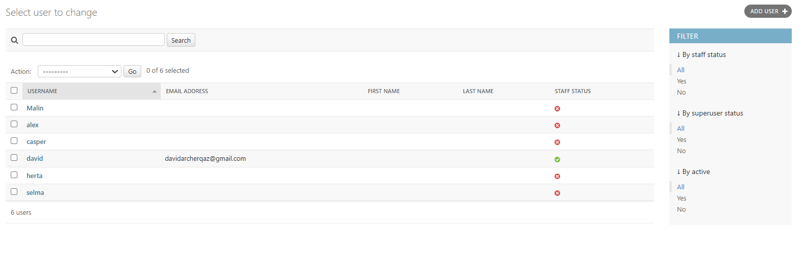
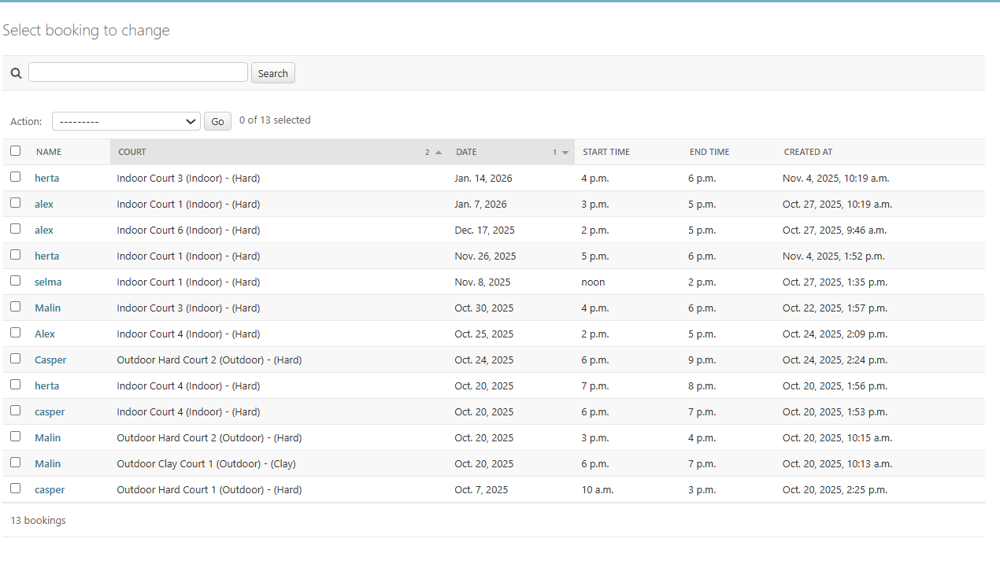
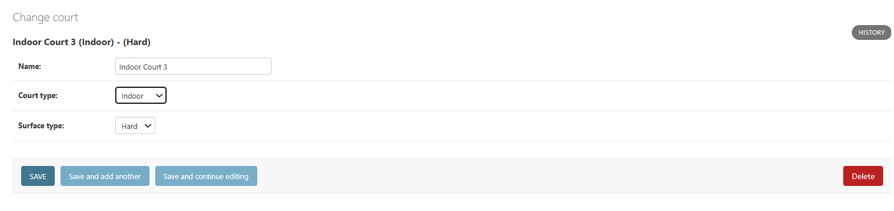
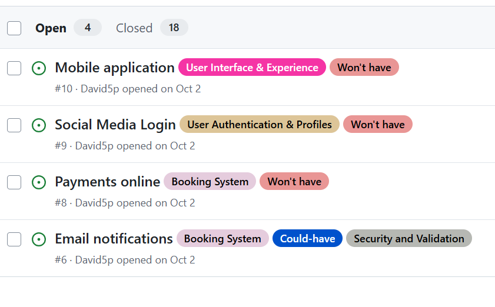

# Play Tennis

Play Tennis is a full-stack, responsive website built for a fictional tennis court booking system for tennis players of all levels.

The website consists of a homepage which allow introduces the club and allows users to book from the homepage. There is also sign up page which allows users to create an account and start making court bookings. Once users have logged in, they can manage their court bookings.

<p align="center">
  
</p>

## Table of Contents

- [Overview](#overview)
- [Agile Methodology](#agile-methodology)
- [User Experience (UX)](#user-experience-ux)
  - [Goals](#goals)
  - [User Stories](#user-stories)
  - [Visual Design](#visual-design)
    - [Wireframes](#wireframes)
    - [Fonts](#fonts)
    - [Icon](#icon)
    - [Colors](#colors)
    - [Images](#images)
    - [Styling](#styling)
- [Features](#features)
  - [Page Elements](#page-elements)
    - [Homepage](#homepage)
    - [Book and Register](#book-and-register)
    - [My Bookings](#my-bookings)
    - [Admin](#admin)
  - [Future Features](#future-features)
- [Technologies Used](#technologies-used)
  - [Languages](#languages)
  - [Libraries and Frameworks](#libraries-and-frameworks)
  - [Other tools](#other-tools)
- [Testing](#testing)
- [Bugs](#bugs)
- [Deployment](#deployment)
- [Credits](#credits)

# Overview

The Play Tennis website is a responsive applications which functions seemlessly on small screens as on your desktop. The website allows users to book from a range of different tennis courts. The website is for tennis players of all levels and uses the Bootstrap front end framework and the Django web application framework.

# Agile Methodology

I used the Agile methodology focussing on planning the project in iterative cycles and placing the different user stories under different epic headings.

The planning of the project was a fluid process as my user stories, which contained acceptance criteria and tasks, scope was initially too big and they needed to be broken down into smaller user stories.

The [MoSCoW Method of Prioritisation](https://www.agilebusiness.org/dsdm-project-framework/moscow-prioririsation.html) was also used. This proved to be a vital tool in priritising the importance of each user story because dividing them up into "Must Have's", "Should Have's", "Could Have's" and "Won't Have's". This provided a clear direction with a large focus on ensuring the "Must Have's" were achieved and the "Won't Have's" providing ideas on the development of the website in the future but not to be achieved at this stage. In other words, the user stories were written to achieve the Minimum Viable Product(MVP).

<details>
<summary>Here are screenshots of my Kanban Board below:</summary>


</details>

Each user story was also placed under an Epic title of one of Admin Management, Booking System, Security and Validation, Court Management, User Authentication and Profiles or User Interface and Experience. This helped organize the tasks and ensured alignment with objectives.

# User Experience

## Goals

Play Tennis aims to provide a platform where tennis players can manage their bookings for tennis courts at the local club. Visitors are given an introduction to the club and the address is listed in the footer. The button to book courts features prominently on the homepage in both the navbar and on the main image of the site.

## User Stories

Each User Story was recorded in [GitHub Issues](https://github.com/David5p/play_tennis/issues). I edited my user stories during the project. My mentor recommended that I elaborate on some of my user stories and break them down into smaller user stories. For instance one of my user stories was originally, "As a user, I want to be able to login and logout of my account." This user story contained lots of different tasks and as you can see below, I broke it down into smaller user stories where more detail was able to be included.

- As a new user, I want to register with an email, username, and password so that I can create an account.

- As a registered user, I want to log in with my credentials so that I can access my account and book courts.

- As a logged-in user, I want to log out securely so that no one else can access my account.

- As a user, I want my password stored securely so that my account remains safe.

- As a user, I want to search for courts by name, location, or type so that I can find the courts I want to play on.

- As a user, I want to cancel a booking before its scheduled start time so that I don’t occupy the slot unnecessarily.

- As a user, I want cancelled bookings to free up the time slot so that other users can book it.

- As a user, I want to see a list of all my bookings so that I know what reservations I have.

- As a user, I want each booking to show the court, date, and time so that I can see all relevant details at a glance.

- As a user, I want the booking history page to be styled clearly so that I can easily read and understand my bookings.

- As a user, I want the website to have a consistent and modern design so that it feels professional and easy to use.

- As a user, I want the website to work well on mobile, tablet, and desktop devices so that I can book courts anywhere.

- As a user, I want an intuitive navigation system so that I can easily find booking, login, and profile pages.

- As a user I can receive an email notification after bookings and cancellations so that I have a record.

- As a user I can pay for bookings online so that I don't have to pay at the venue.

- As a user I can log in with my Google or Facebook account so that I don't need a separate password.

- As a user I can book courtsthrough a mobile app so that I can access the platform on the go.

- As an admin, I want to extend the Court model with location and type so that users can filter courts effectively.

- As an admin, I want to add and edit courts so that I can maintain accurate court information.

- As an admin, I want to define available time slots for each court so that users can book them.

- As an admin, I want to delete or modify bookings so that I can manage user reservations.

- As an admin, I want to filter bookings by date, court, or user so that I can quickly find relevant reservations.

## Visual Design

### Wireframes

Wireframes: https://drive.google.com/file/d/1jKxvqleNVu_oNVqvZlpYt43qoXmn766d/view?usp=drive_link

- I used Balsamiq for my wireframes. The design for desktop and mobile screens is similar with the main difference the navbar. On mobile screens the navbar menu changes to a burger icon.

### Fonts

- The primary font, Bebas Neue was chosen because it provides a modern and professional look text. It is a font that provides a strong visual impact and works effectively for main headings and sub headings. This sans-serif font is versatile and combines well with my color schemes across the website as well as my secondary font choice.

- The secondary font, Roboto was chosen for its readability and the reliable pair it makes with Bebas Neue. It provides a modern feel and the rounded, natural letter shapes give it warmth and approachability. Roboto functions well as my font choice for body text.

### Icons

- The favicon is an [image of a tennis ball reflecting off the court surface](https://www.pexels.com/photo/selective-focus-photography-of-tennis-ball-on-floor-2352372/).
- My Favicon was then generated by [favicon.io](https://favicon.io/) and the color of the court matches my color scheme well.
- [The logo showing two rackets](https://favpng.com/png_view/tennis-racket-tennis-rackets-and-ball-simple-illustration-png/9bB5bFUg#google_vignette) looks stylish in my navbar and I wanted an image with two rackets to demonstrate an interaction for the club where people come and play together.

### Colors

<p align="center">
  
</p>

- I picked the colors (image above is a screenshot taken from [Coolors](https://coolors.co/)) of the website from the hero image using an [image color picker](https://imagecolorpicker.com/) tool to help me with my choices.

<p align="center">
  
</p>

- I have to vary some of the shades of my color choice from the main image to ensure the contrast was sufficient. For example, You can see below that I needed to darken the mifnight green navbar color to have the menu text in white and meet the contrast requirements.

<p align="center">
  
</p>

- After the selection of the midnight green background for my navbar inside the header, I chose a background color of silver for my footer. I had initially considered midnight green for my footer as well but realised this can make the page seem monotonous and the use of a contrast helps create a clear structure.

- The silver and midnight green pairing provides a clean and modern aesthetic that feels calm, stable, and visually harmonious.

### Images

- The main image on the homepage was chosen as it conveys community, activity, and accessibility. The row of players holding rackets suggests teamwork and readiness, appealing to both casual and competitive players. The image has bright, natural lighting and relaxed composition create an inviting atmosphere that encourages users to get involved and play.

### Styling

- I used Bootstrap 5.3 grid system where possible to support with positioning, text style and size.
- I have applied my preferred colors and fonts using custom css.
- I applied custom styles to the base.html so that all my pages had the same structure, layout and styles.
- I have added in JavaScript so that the end time automatically sets an hour later than the start time.

<p align="center">
  
</p>

## Features

### Page Elements

#### Homepage

- The homepage has a simple navbar and the 'make a booking' button features prominently.

<p align="center">
  
</p>

- A brief introduction to the club is also provided on the homepage.

- The footer also features on all pages and contains social media links, the address of the venue and contact details.

#### Book and Register

- When the user clicks on the book page they are invited to login or to register.

<p align="center">
  
</p>

<p align="center">
  
</p>

- I decided to only allow registered users to have the ability to book courts because users should be repeat visitors to the site.
- If the user tries to book a court without signing in they are redirected to the login page.
- Once the user is logged in, they can submit the form to book a court.
- All the fields in the form are set as a required field, hence any field left blank will not allow user to proceed and book a court until it is filled.

- The name field originally appeared on the booking form and autofilled with the username. To streamline the process and avoid redundancy (as users are already logged in), it’s now automatically assigned when a booking is created.

- The email field requires the @ symbol to be included. This also could have been removed but could have merit in future development should booking confirmations be sent to the user's email.

- The Date Field only allows the user to choose from the current date or future date. It doesn't allow the user to proceed with booking an outdoor court from December to March.

- The Time field only shows the times a user can book a court from and is also validated so a court cannot be booked at the same time twice or have any overlapping time.

- If the information entered passes validation, the Book button directs the user back to their personalised My booking page, where they can view or edit any existing upcoming bookings and view past bookings.

- The style is consistent with the rest of the webpage and it is fully responsive.

#### My Bookings

- Once logged in, the user can view a personalised page where their bookings past and present are listed.

<p align="center">
  
</p>

- The user can cancel or amend any upcoming bookings.

#### Admin

- The website offers the owner the ability to view, edit and interact with the database in the Django Admin panel.

- The admin panel is accessible by the addition of /admin at the end of the website's URL.

- The user is then taken to the Django Administration Login page and asked to provide their login credentials. Only users with Superuser status can accesss the admin panel.

<p align="center">
  
</p>

- The Superuser has permissions which include:

  - Add or remove users.

    <p align="center">
    
    </p>

  - Edit or delete court bookings.

    <p align="center">
    
    </p>

  - Edit, delete or add courts.

    <p align="center">
    
    </p>

  - Filter bookings by name, court, date or using the search bar.

### Future Features

- Future plans mentioned in my user stories include the ability to make online payments, sign in using social media, email confirmations of bookings and a mobile application.

<p align="center">
  
</p>

- Other future plans for the site include, a forgotten password button that would allow users to reset their password, a photo gallery and tiered membership costs.

## Technologies Used

### Languages

- [HTML5](https://www.w3schools.com/html/)
  Page markup
- [CSS](https://www.w3schools.com/css/default.asp)
  Styling

- [Python](https://www.python.org/)
  Server-side development with Django

- [JavaScript](https://www.w3schools.com/js/)
  Behaviour

### Libraries and Frameworks

[Django 4.2.25](https://docs.djangoproject.com/en/5.2/releases/4.2.25/) - Free and open source Python Web Framework.

[Gunicorn 20.1.0](https://docs.gunicorn.org/en/20.1.0/) - A Python WSGI HTTP server compatible with Django and used to run the project on Heroku.

[PostgreSQL 15.13](https://www.postgresql.org/docs/release/15.13/) - A powerful, open-source object-relational database system.

[Pyscopg2 2.9.10](https://pypi.org/project/psycopg2/2.9.10/) - A PostgreSQL database adapter for Python.

[Heroku](https://www.heroku.com/) - A cloud platform as a service.

[Django Crispy forms](https://django-crispy-forms.readthedocs.io/en/latest/) - Simplifies rendering and styling forms, allowing dynamic layouts with Bootstrap.

[Bootstrap 5.3.2](https://getbootstrap.com/docs/5.3/getting-started/download/) - A Framework for building responsive, mobile-fist sites.

[Whitenoise==6.11.0](https://pypi.org/project/whitenoise/) - WhiteNoise is used for serving static files in a Django application.

[sqlparse==0.5.3](https://pypi.org/project/sqlparse/#history) - SQLParse is a library used for parsing SQL queries in Python.

### Other Tools

[GitHub](https://github.com/) - Storing code remotely and deployment.

[Visual Studio Code](https://code.visualstudio.com/) - IDE for project development.

[W3C Validator](https://validator.w3.org/) - A validator which checks the markup validity of Web documents in HTML.

[W3C CSS Validation Service](https://jigsaw.w3.org/css-validator/) - A validator which checks the validity of CSS code.

[Code Institute's Python Linter](https://pep8ci.herokuapp.com/) - Highlights syntactical and stylistic problems in Python.

[Chrome DevTools](http://developer.chrome.com/docs/devtools) - Web Developer Tools used to test responsiveness and styles.

[User Interface](https://ui.dev/amiresponsive) - For responsive visuals of the website

[Pexels](https://www.pexels.com/) - Used for the favicon image.

[FAVPNG](https://favpng.com/) - Used an image for the logo on all site pages.

[Coolors](https://coolors.co/) - Colour Palette Generator

[Google Fonts](https://fonts.google.com/) - Fonts

[Balsamiq](https://balsamiq.cloud/#) - Low Fidelity Wireframes

## Testing

All testing information can be found in [TESTING.md](TESTING.md).

## Bugs

Bbugs discovered have been resolved. However. there could ramain unknown bugs, which were not found during the testing process.

<details>
<summary>Early Deployment Bug</summary>

Problem: When a deployment was made on Heroku, The navbar was not showing or functioning

        Application error


Solution: This issue was shorted out by updating my Procfile with correct file name.

</details>
<details>
<summary>Bugs during Development</summary>

Problem: Tried to use sticky-top class on navbar but on midway it stops working on menu page on mobile.

Solution: Removed sticky-top class as suggested by my mentor.

Problem: Phone field was not accepting all combination of number, since it was an integer field.

        Phone field error


Solution: This issue was shorted out by changing the phonefield to charField and also by recreating a new database file as there was problem in Deployment.

Problem: since the Phone field was changed from integer to string, there was database, session error.

        Database error


Solution: This issue was shorted out by changing the database url as too many manipulation on previous database file was not allowing the changes in deployment. A new superuser was created to overcome this error as advised by Tutor.

</details>

<details>
<summary>Bugs encountered during Testing</summary>

**Make a reservation Form Fields**

Problem: Name field accepting all the characters including special chars and numbers

Solution: Validation included to accept only alphabets.

```
if not value.isalpha():
        raise ValidationError(
            'Name can only contain alphabetic characters. '
            'Please check your entry.'
        )
```

Problem: Date field accepting past date and all future dates

Solution: Validation included to accept only current date and future date upto 6 months.

```
today = timezone.now().date()
    # Approximation for 6 months
    six_months_from_today = today + datetime.timedelta(days=6*30)
    if not (today <= value <= six_months_from_today):
        raise ValidationError(
            "Reservation date must be between today and the next 6 months.")
```

Problem: Seat field accepting zero and negative numbers

Solution: Two diff validation included to accept only number from 1 till the capacity of the Table size.

```
if value <= 0:
        raise ValidationError(
            'The number of guests must be greater than zero. '
            'Please enter a valid number.'
        )

if table and guests:
            if guests > table.capacity:
                self.add_error('guests', f"The number of guests exceeds the "
                               f"table's capacity of {table.capacity}. "
                               f"Please choose another table.")
```

Problem: Note field accepting unlimited number characters.

Solution: Validation included to accept only characters upto 1000.

```
notes = forms.CharField(
        max_length=1000,
        widget=forms.Textarea(
            attrs={'class': 'form-control', 'maxlength': 1000}
        )
)
```

</details>
