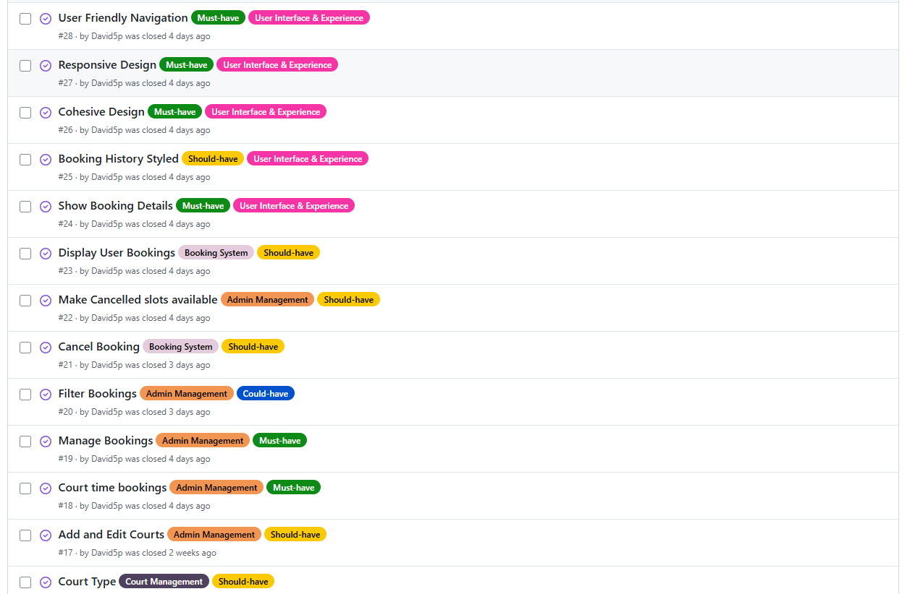

# Play Tennis

Play Tennis is a full-stack, responsive website built for a fictional tennis court booking system for tennis players of all levels.

The website consists of a homepage which allow introduces the club and allows users to book from the homepage. There is also sign up page which allows users to create an account and start making court bookings. Once users have logged in, they can manage their court bookings.

  

## Table of Contents

- [Overview](#overview)
- [Agile Methodology](#agile-methodology)
- [User Experience (UX)](#user-experience-ux)
  - [Goals](#goals)
  - [User Stories](#user-stories)
  - [Visual Design](#visual-design)
    - [Wireframes](#wireframes)
    - [Fonts](#fonts)
    - [Icon](#icon)
    - [Colors](#colors)
    - [Images](#images)
    - [Styling](#styling)
- [Features](#features)
  - [Existing Features](#existing-features)
  - [Future Features](#future-features)
- [Technologies Used](#technologies-used)
  - [languages](#Languages)
  - [Frameworks](#frameworks)
  - [Libraries](#libraries)
  - [Platforms](#platforms)
  - [Other tools](#other-tools)
- [Testing](#testing)
- [Bugs](#bugs)
- [Deployment](#deployment)
- [Credits](#credits)

# Overview

The Play Tennis website is a responsive applications which functions seemlessly on small screens as on your desktop. The website allows users to book from a range of different tennis courts. The website is for tennis players of all levels and uses the Bootstrap front end framework and the Django web application framework.

# Agile Methodology

I used the Agile methodology focussing on planning the project in iterative cycles and placing the different user stories under different epic headings.

The planning of the project was a fluid process as my user stories, which contained acceptance criteria and tasks, scope was initially too big and they needed to be broken down into smaller user stories.

The [MoSCoW Method of Prioritisation](https://www.agilebusiness.org/dsdm-project-framework/moscow-prioririsation.html) was also used. This proved to be a vital tool in priritising the importance of each user story because dividing them up into "Must Have's", "Should Have's", "Could Have's" and "Won't Have's". This provided a clear direction with a large focus on ensuring the "Must Have's" were achieved and the "Won't Have's" providing ideas on the development of the website in the future but not to be achieved at this stage. In other words, the user stories were written to achieve the Minimum Viable Product(MVP).

Here are screenshots of my Kanban Board below:

Each user story was also placed under an Epic title of one of Admin Management, Booking System, Security and Validation, Court Management, User Authentication and Profiles or User Interface and Experience. This helped organize the tasks and ensured alignment with objectives.

# User Experience

## Goals

Play Tennis aims to provide a platform where tennis players can manage their bookings for tennis courts at the local club. Visitors are given an introduction to the club and the address is listed in the footer. The button to book courts features prominently on the homepage in both the navbar and on the main image of the site.

## User Stories

Each User Story was recorded in [GitHub Issues](https://github.com/David5p/play_tennis/issues). I edited my user stories during the project. My mentor recommended that I elaborate on some of my user stories and break them down into smaller user stories. For instance one of my user stories was originally, "As a user, I want to be able to login and logout of my account." This user story contained lots of different tasks and as you can see below, I broke it down into smaller user stories where more detail was able to be included.

- As a new user, I want to register with an email, username, and password so that I can create an account.

- As a registered user, I want to log in with my credentials so that I can access my account and book courts.

- As a logged-in user, I want to log out securely so that no one else can access my account.

- As a user, I want my password stored securely so that my account remains safe.

- As a user, I want to search for courts by name, location, or type so that I can find the courts I want to play on.

- As a user, I want to cancel a booking before its scheduled start time so that I don’t occupy the slot unnecessarily.

- As a user, I want cancelled bookings to free up the time slot so that other users can book it.

- As a user, I want to see a list of all my bookings so that I know what reservations I have.

- As a user, I want each booking to show the court, date, and time so that I can see all relevant details at a glance.

- As a user, I want the booking history page to be styled clearly so that I can easily read and understand my bookings.

- As a user, I want the website to have a consistent and modern design so that it feels professional and easy to use.

- As a user, I want the website to work well on mobile, tablet, and desktop devices so that I can book courts anywhere.

- As a user, I want an intuitive navigation system so that I can easily find booking, login, and profile pages.

- As a user I can receive an email notification after bookings and cancellations so that I have a record.

- As a user I can pay for bookings online so that I don't have to pay at the venue.

- As a user I can log in with my Google or Facebook account so that I don't need a separate password.

- As a user I can book courtsthrough a mobile app so that I can access the platform on the go.

- As an admin, I want to extend the Court model with location and type so that users can filter courts effectively.

- As an admin, I want to add and edit courts so that I can maintain accurate court information.

- As an admin, I want to define available time slots for each court so that users can book them.

- As an admin, I want to delete or modify bookings so that I can manage user reservations.

- As an admin, I want to filter bookings by date, court, or user so that I can quickly find relevant reservations.

## Visual Design

### Wireframes

Wireframes: https://drive.google.com/file/d/1jKxvqleNVu_oNVqvZlpYt43qoXmn766d/view?usp=drive_link

- I used Balsamiq for my wireframes. The design for desktop and mobile screens is similar with the main difference the navbar. On mobile screens the navbar menu changes to a burger icon.

### Fonts

- The primary font, Bebas Neue was chosen because it provides a modern and professional look text. It is a font that provides a strong visual impact and works effectively for main headings and sub headings. This sans-serif font is versatile and combines well with my color schemes across the website as well as my secondary font choice.

- The secondary font, Roboto was chosen for its readability and the reliable pair it makes with Bebas Neue. It provides a modern feel and the rounded, natural letter shapes give it warmth and approachability. Roboto functions well as my font choice for body text.

### Icons

- The favicon is an [image of a tennis ball reflecting off the court surface](https://www.pexels.com/photo/selective-focus-photography-of-tennis-ball-on-floor-2352372/).
- My Favicon was then generated by [favicon.io](https://favicon.io/) and the color of the court matches my color scheme well.
- [The logo showing two rackets](https://favpng.com/png_view/tennis-racket-tennis-rackets-and-ball-simple-illustration-png/9bB5bFUg#google_vignette) looks stylish in my navbar and I wanted an image with two rackets to demonstrate an interaction for the club where people come and play together.

### Colors

  

- I picked the colors (image above is a screenshot taken from [Coolors](https://coolors.co/)) of the website from the hero image using an [image color picker](https://imagecolorpicker.com/) tool to help me with my choices.

  

- I have to vary some of the shades of my color choice from the main image to ensure the contrast was sufficient. For example, You can see below that I needed to darken the mifnight green navbar color to have the menu text in white and meet the contrast requirements.

  

- After the selection of the midnight green background for my navbar inside the header, I chose a background color of silver for my footer. I had initially considered midnight green for my footer as well but realised this can make the page seem monotonous and the use of a contrast helps create a clear structure.

- The silver and midnight green pairing provides a clean and modern aesthetic that feels calm, stable, and visually harmonious.
