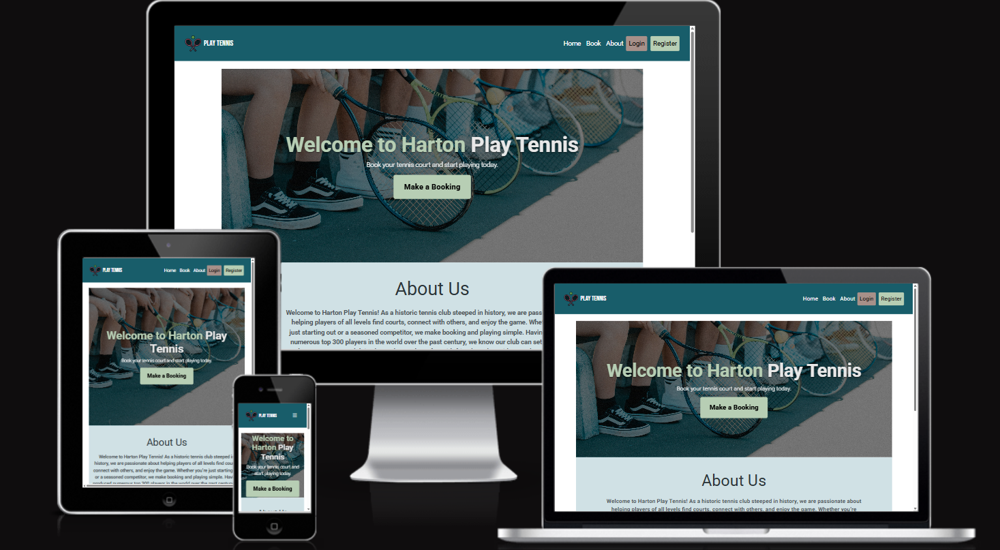

# Play Tennis

Play Tennis is a full-stack, responsive website built for a fictional tennis court booking system for tennis players of all levels.

The website consists of a homepage which allow introduces the club and allows users to book from the homepage. There is also sign up page which allows users to create an account and start making court bookings. Once users have logged in, they can manage their court bookings.

  

## Table of Contents

- [Overview](#overview)
- [Agile Methodology](#agile-methodology)
- [User Experience (UX)](#user-experience-ux)
  - [Goals](#goals)
  - [User Stories](#user-stories)
  - [Visual Design](#visual-design)
  - [Wireframes](#wireframes)
- [Features](#features)
  - [Existing Features](#existing-features)
  - [Future Features](#future-features)
- [Technologies Used](#technologies-used)
  - [languages](#Languages)
  - [Frameworks](#frameworks)
  - [Libraries](#libraries)
  - [Platforms](#platforms)
  - [Other tools](#other-tools)
- [Testing](#testing)
- [Bugs](#bugs)
- [Deployment](#deployment)
- [Credits](#credits)
