# Manual and Automated Testing

Both manual and automated testing were crucial in ensuring my website was functional. Manual testing verified key features including booking, editing, and canceling courts, from both user and admin perspectives, ensuring usability and workflow correctness. By simulating real user interactions such as creating an account, making court bookings, it helps identify bugs, improve user experience, and ensure the site meets functional requirements.

I also performed some automated testing on the forms, models, views and urls. This helped to verify that each component of the tennis booking website functions as expected. They quickly ensure data integrity, validate routing, and confirm form behavior. The use of automated testing increases reliability and reduces the risk of introducing bugs during updates or new feature additions.

# Table of Contents

- [Code Validation](#code-validation)
- [Lighthouse](#lighthouse-testing)
- [Responsiveness](#responsiveness-testing)
- [Browser Compatibility](#browser-compatibility-testing)
- [Automated Testing of user stories](#automated-testing-of-user-stories)

## Code Validation

### HTML

- HTML code was tested using the [W3C Validator](https://validator.w3.org/) via url.

- I received 8 info alerts from the HTML validator relating to trailing slashes. This is due to the add on prettier formatting my HTML and they cannot be removed. The trailing slash on void elements doesn’t affect rendering or cause any errors in my code.

- Initially, the `home.html` and `register.html` templates triggered a semantic HTML warning because they each contained a `<h1>` element, while `base.html` already included a `<h1>`. To resolve this, the page-specific headings were changed to `<h2>` to maintain proper heading hierarchy and improve accessibility.

Screenshots and results for all templates.

 

**HOME**

**LOG IN**

**REGISTER**

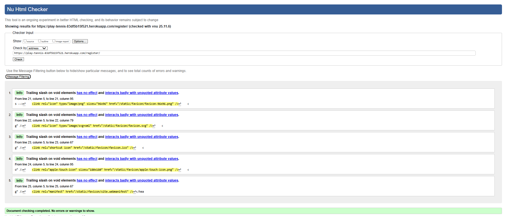

**My Bookings**

**Edit Booking**

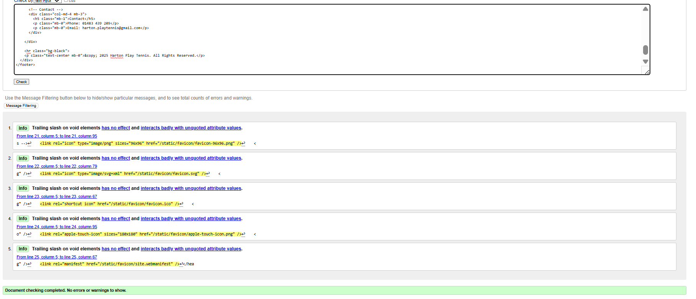

 

### CSS

- CSS code was tested using the [W3C CSS Validation Service](https://jigsaw.w3.org/css-validator/) via text input.

- Some validator warnings appeared for lines using CSS variables (e.g., var(--main-color)). These are informational only because the validator cannot determine dynamic values. They do not indicate errors, and the CSS works correctly in browsers.

  

Screenshot with results for the styles.css file

**styles.css**

 

### Python

Python code was tested using [Code Institute's Python Linter](https://pep8ci.herokuapp.com/).

Screenshots and results for all python files

- settings.py

Line too long warning for line 85, 87, 88, 112 was unaltered as it is Django code and not making any alterations as advised by fellow Discord members.

- tennis urls.py

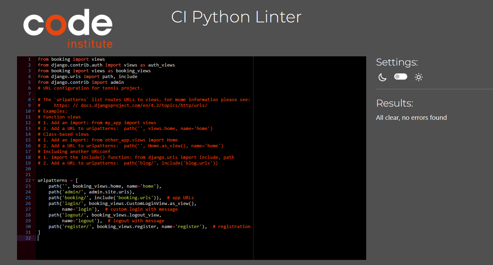

- booking urls.py

- admin.py

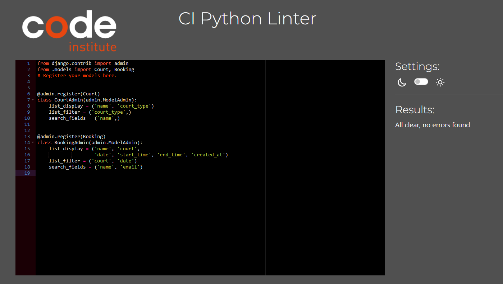

- apps.py

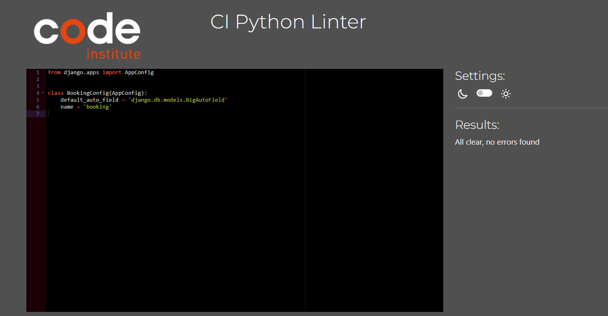

- forms.py

- models.py

- views.py

- Testing test_urls.py

- Testing test_forms.py

- Testing test_models.py

- Testing test_views.py

 

### JavaScript

The JavaScript code was tested using [JS Hint](https://jshint.com/).

Screenshots and results for JavaScript files

- booking.js

 

## Lighthouse Testing

[Lighthouse](https://developer.chrome.com/docs/lighthouse/overview/) was used to audit the website for performance, accessibility, best practice and SEO. This was run in Chrome DevTools in incognito mode.

- At the beginning of the Lighthouse testing, I noticed the performace of my website being negated by the high quality of my homepage image.
  The performance rating was greatly improved upon the reduction of the file size.

  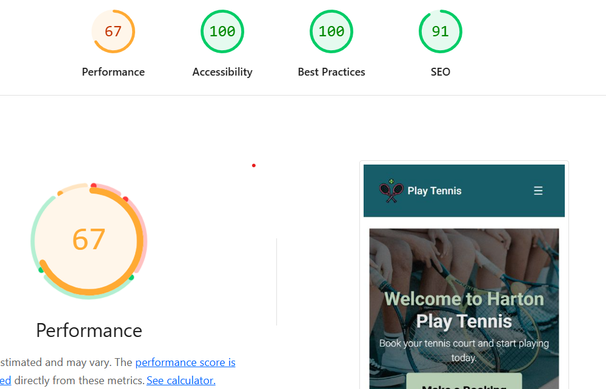

- I also had to edit my HTML so that it followed HTML semantics as this was negatively affecting the accessibility score.

Screenshots and results for all pages

**HOME**

- Mobile

- Desktop

**Login**

- Mobile

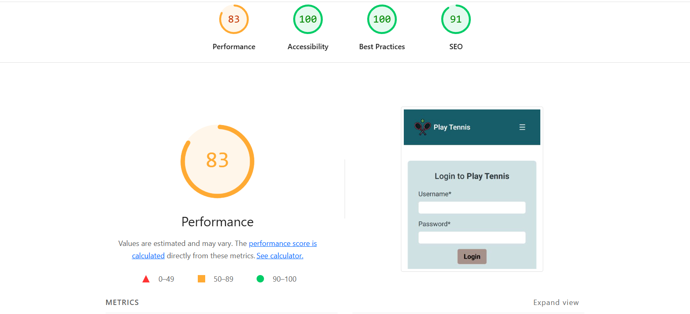

- Desktop

**Register**

- Mobile

- Desktop

**Book**

- Mobile

- Desktop

**My Bookings**

- Mobile

- Desktop

**Edit Booking**

- Mobile

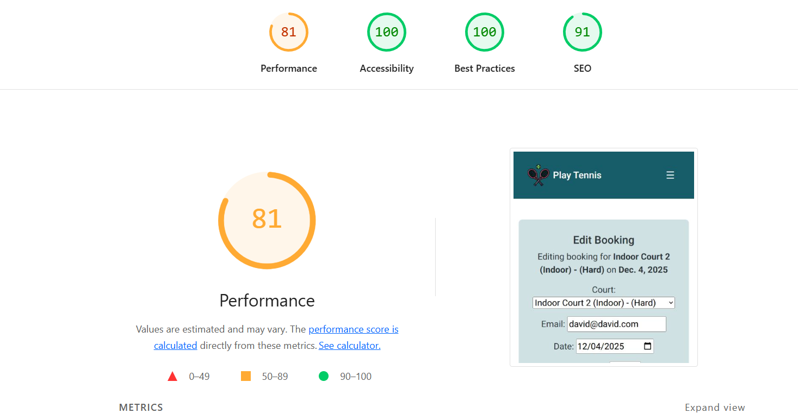

- Desktop

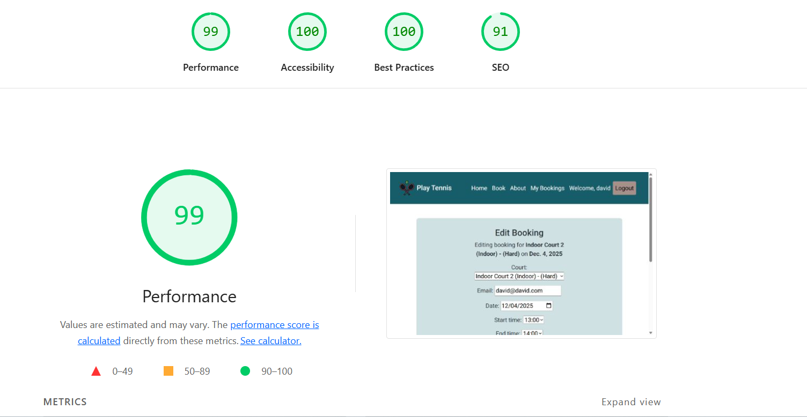

 

## Responsiveness Testing

The website is responsive for screens with a mininum width of 320px and a maximum width of 2560px. Friends tested the website on their devices and found the website responsive. Further manual tests were done using [Chrome's DevTools](https://developer.chrome.com/docs/devtools) and the website proved to be responsive.

Screenshots of website at different screen sizes.

**Responsiveness on different devices**

        Mobile - Asus Zenfone 8

        Mobile - Asus Zenfone 8

        Tablet - iPad 6 - horizontal

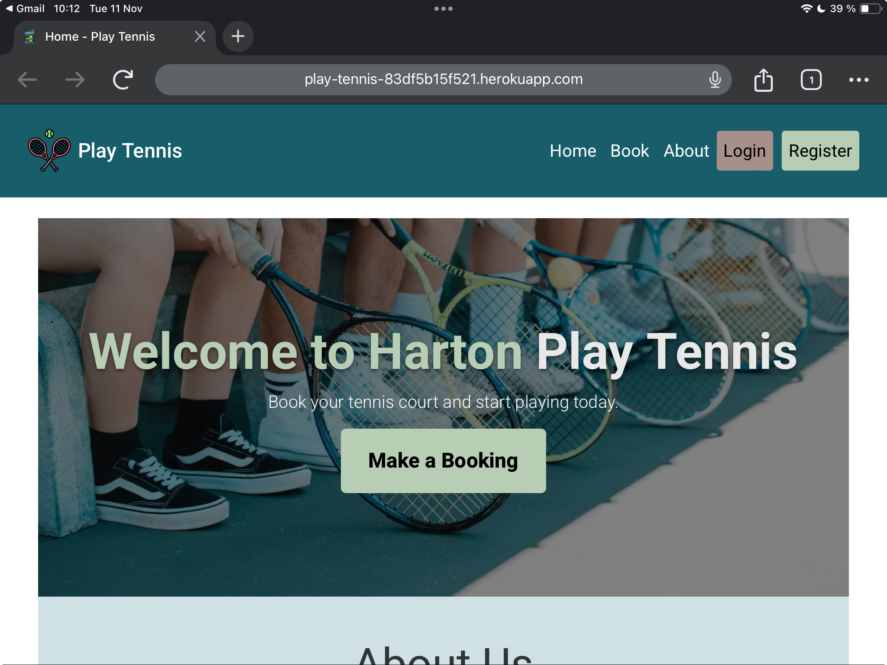

        Tablet - iPad 6 - vertical

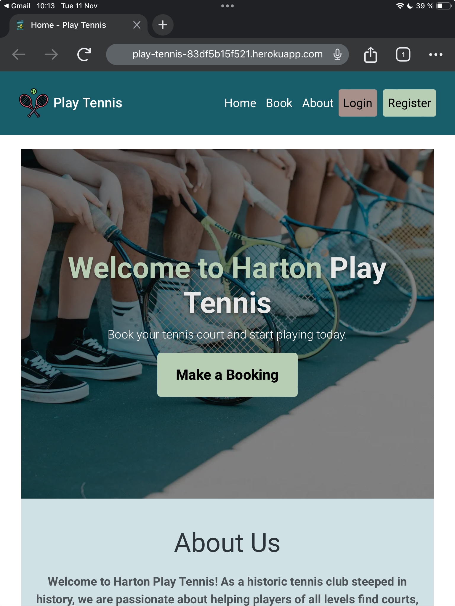

 

 

## Browser Compatibility Testing

Website was tested on current Chrome, Firefox and Edge for compatibility.

Table of the results.

| Intended       | Chrome | Firefox | Edge | Safari |
| -------------- | ------ | ------- | ---- | ------ |
| Appearance     | Good   | Good    | Good | Good   |
| Responsiveness | Good   | Good    | Good | Good   |

**Responsiveness on different devices**

        Chrome Browser

        Firefox Browser

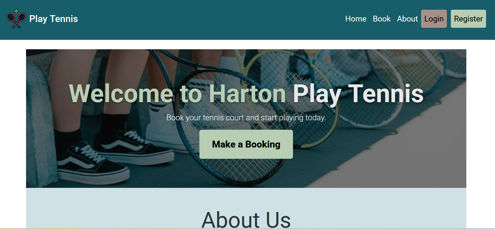

        Edge Browser

 

## Automated Testing of User Stories

- The use of automated testing ensures the app works correctly and that all user stories developed using agile methodology have been achieved as expected. It enables catching bugs early and verifying forms, models, URLs, and views behave as expected. It allows safe updates and feature additions. This improves reliability, maintainability, and overall confidence in the project’s functionality.

- The booking/tests/test_forms.py file ensures that the BookingForm correctly validates user input, including required fields and logical constraints like start and end times.

- The booking/tests/test_models.py verifies the Booking model’s behavior, checking that bookings conform to rules such as hourly start times and can be saved properly.
- The booking/tests/test_urls.py confirms that URL patterns resolve to the correct views, ensuring proper routing.

- Finally, the booking/tests/test_views.py tests the views’ functionality, including access control, form submission, and page responses, ensuring the web interface behaves as expected for both authenticated and anonymous users.

